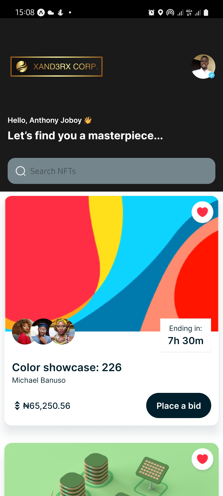
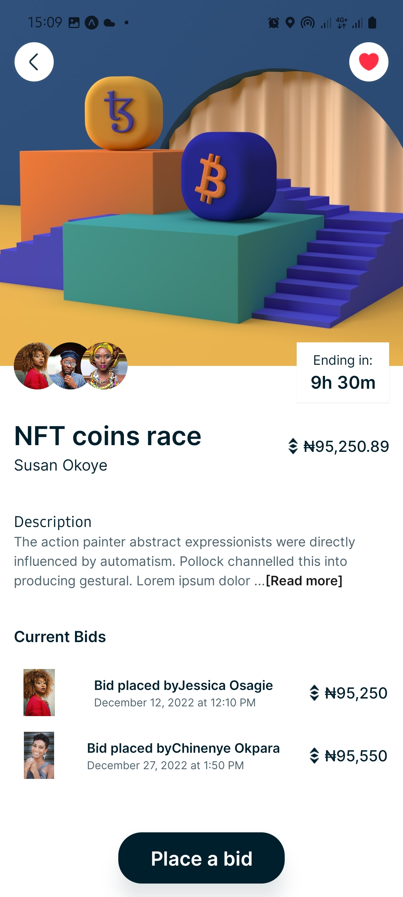

# React Native NFT Marketplace

An attractive UI design for an NFT marketplace cross-platform React Native mobile application.

## About NFT Marketplace

This react native NFT Marketplace application features the following:

1. A home page to display list of NFT's
2. Search functionality
3. A details page to provide information about the selected NFT and see the active bids.

## What is non-fungible token(NFT)?

A non-fungible token (NFT) is a cryptographic token that represents a unique asset. They function as verifiable proofs of authenticity and ownership within a blockchain network. NFTs are not interchangeable with each other and introduce scarcity to the digital world. [Read more](https://www.binance.com/en/nft/home)

## Project setup

1. Run `npm install --legacy-peer-deps` to install dependencies.
2. Run `npm start` to start the expo client and connect your devices using Expo Go with localhost IP generated for you.

# Project Screenshot

|            Home Screen             |            Details Screen             |
| :--------------------------------: | :-----------------------------------: |
|  |  |
